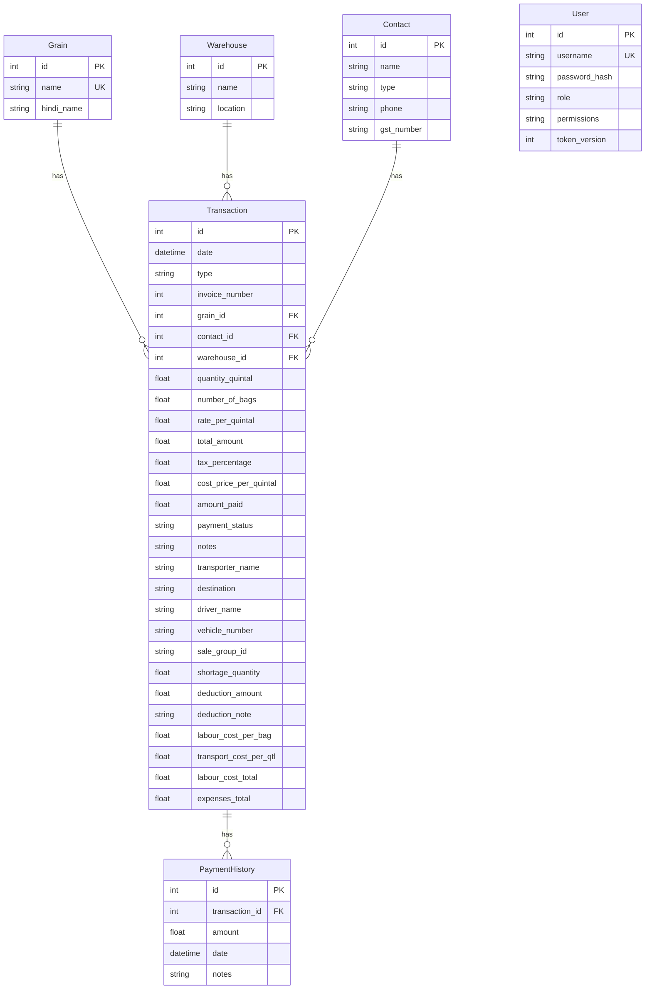

# Database Schema Documentation

## Overview

The application uses a **relational database** (PostgreSQL in production via Supabase, SQLite for local development). All tables are managed via **SQLModel** (a combination of SQLAlchemy + Pydantic).

---

## Entity Relationship Diagram (ERD)

---

## Table Definitions

### 1. `Grain`

Stores types of grains traded.

| Column | Type | Constraints | Description |
|--------|------|-------------|-------------|
| `id` | Integer | **PK**, Auto-Increment | Unique identifier |
| `name` | String | **Unique**, Indexed | English name (e.g., "Wheat") |
| `hindi_name` | String | Optional | Hindi name (e.g., "Gehu") |

---

### 2. `Warehouse`

Stores physical storage locations (godowns).

| Column | Type | Constraints | Description |
|--------|------|-------------|-------------|
| `id` | Integer | **PK**, Auto-Increment | Unique identifier |
| `name` | String | Required | Warehouse name (e.g., "Main Godown") |
| `location` | String | Optional | Address or location details |

---

### 3. `Contact`

Stores suppliers (farmers), buyers, and brokers.

| Column | Type | Constraints | Description |
|--------|------|-------------|-------------|
| `id` | Integer | **PK**, Auto-Increment | Unique identifier |
| `name` | String | Required | Contact name |
| `type` | String | Required | One of: `supplier`, `buyer`, `broker` |
| `phone` | String | Optional | Phone number |
| `gst_number` | String | Optional | GST/Tax ID |

---

### 4. `Transaction`

Core table for **Purchase** and **Sale** bills. This is the most important table.

| Column | Type | Constraints | Description |
|--------|------|-------------|-------------|
| `id` | Integer | **PK**, Auto-Increment | Unique identifier |
| `date` | DateTime | Default: `now()` | Transaction date |
| `type` | String | Required | `purchase` or `sale` |
| `invoice_number` | Integer | Auto-Generated | Sequential invoice number (per type) |
| `grain_id` | Integer | **FK** → `grain.id` | Grain being traded |
| `contact_id` | Integer | **FK** → `contact.id` | Supplier/Buyer |
| `warehouse_id` | Integer | **FK** → `warehouse.id` | Storage location |
| `quantity_quintal` | Float | Required | Total weight in Quintals (100 kg) |
| `number_of_bags` | Float | Optional | Number of bags |
| `rate_per_quintal` | Float | Required | Price per Quintal (₹) |
| `total_amount` | Float | Required | Grand Total (may include tax, deductions) |
| `tax_percentage` | Float | Default: `0.0` | GST percentage |
| `cost_price_per_quintal` | Float | Default: `0.0` | Average purchase cost (for profit calc) |
| `amount_paid` | Float | Default: `0.0` | Amount received/paid so far |
| `payment_status` | String | Default: `pending` | `pending`, `partial`, `paid` |
| `notes` | String | Optional | Any notes |
| **Sale-Specific Fields** |
| `transporter_name` | String | Optional | Transporter company/person |
| `destination` | String | Optional | Delivery destination |
| `driver_name` | String | Optional | Driver's name |
| `vehicle_number` | String | Optional | Truck/vehicle number |
| `sale_group_id` | String (UUID) | Optional | Groups multi-warehouse sales into one bill |
| **Deduction Fields (Sale)** |
| `shortage_quantity` | Float | Default: `0.0` | Quantity short/lost during transport |
| `deduction_amount` | Float | Default: `0.0` | Monetary deduction (quality claims) |
| `deduction_note` | String | Optional | Reason for deduction |
| **Cost Fields** |
| `labour_cost_per_bag` | Float | Default: `3.0` | Labour/Palledari per bag (₹) |
| `transport_cost_per_qtl` | Float | Default: `0.0` | Transport cost per Quintal (₹) |
| `labour_cost_total` | Float | Default: `0.0` | Calculated: `bags × labour_per_bag` (for purchase deduction) |
| `expenses_total` | Float | Default: `0.0` | Calculated: Labour + Transport (for sale profit calc) |

---

### 5. `PaymentHistory`

Tracks individual payments against a transaction.

| Column | Type | Constraints | Description |
|--------|------|-------------|-------------|
| `id` | Integer | **PK**, Auto-Increment | Unique identifier |
| `transaction_id` | Integer | **FK** → `transaction.id` | Parent transaction |
| `amount` | Float | Required | Amount paid in this entry |
| `date` | DateTime | Default: `now()` | Payment date |
| `notes` | String | Optional | Payment notes |

---

### 6. `User`

Stores application users and their credentials.

| Column | Type | Constraints | Description |
|--------|------|-------------|-------------|
| `id` | Integer | **PK**, Auto-Increment | Unique identifier |
| `username` | String | **Unique**, Indexed | Login username |
| `password_hash` | String | Required | Hashed password (PBKDF2-SHA256) |
| `role` | String | Default: `worker` | `admin` or `worker` |
| `permissions` | String (JSON) | Default: `[]` | JSON array of allowed modules |
| `token_version` | Integer | Default: `1` | Incremented on password change to revoke tokens |

---

## Key Relationships

| Relationship | Description |
|--------------|-------------|
| `Transaction → Grain` | Each transaction is for one grain type |
| `Transaction → Contact` | Each transaction is with one contact |
| `Transaction → Warehouse` | Each transaction affects one warehouse's inventory |
| `Transaction → PaymentHistory` | A transaction can have multiple partial payments (Cascade Deleted via App Logic) |
| `Transaction.sale_group_id` | Groups multiple sale transactions into one bill (multi-warehouse sale) |

---

## Business Logic Notes

1. **Invoice Numbers**: Auto-incremented **per transaction type** (purchases and sales have separate sequences).
2. **Payment Status**: Automatically updated based on `amount_paid` vs `total_amount` (with deductions considered for sales).
3. **Inventory**: Calculated dynamically from transactions (no separate inventory table). Purchases add, sales subtract.
4. **Profit Calculation**: `Sale Net Amount - (Cost Price × Quantity) - Expenses`
5. **Stock Validation**: Sales are blocked if requested quantity exceeds available stock in a specific warehouse.
